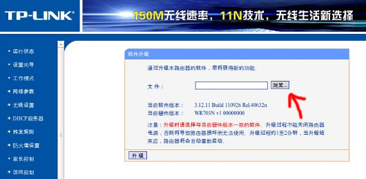

- Go to [OpenWrt WR703N wiki page](http://wiki.openwrt.org/toh/tp-link/tl-wr703n#flashing) and download the latest squashfs-factory.bin firmware (keep in mind that although this is what most people use - this is not the latest stable version, but the bleeding edge OpenWrt firmware snapshot from the trunk which work just fine in most cases (if you want the latest stable version get the latest [stable version](http://wiki.openwrt.org/about/history#stable.releases)))

  _**edit**: I have only been using the trunk version myself, and I've been told that there is no stable version for WR703N (yet) since it got supported some time after the latest stable release (Backfire 10.03.1)_

- Connect the WR703N directly to your PC using ethernet cable (WR703N will use 192.168.1.1 by default so if you try to connect it to your router/switch instead, it will probably start causing problems since most home routers have the default IP of 192.168.1.1 and you will have two devices on your network with conflicting IP addresses)

- Set a static IP address on your PC (it must be in 192.168.1.X range, different from WR703n's 192.168.1.1 and with 255.255.255.0 subnet mask)

- Go to http://192.168.1.1/ and log in using admin/admin credentials

- Now go to http://192.168.1.1/userRpm/SoftwareUpgradeRpm.htm (according to Gene Wood's comment, after the 1.6 update you will not be able go to this link directly any more but instead you will have to navigate through the menu manually, he wrote down the correct menu navigation sequence on [his wiki page](http://wiki.cementhorizon.com/display/CH/Installing+OpenWRT+on+the+TP-Link+WR703N+v1.6) so feel free to check it out).
- Click on the grey button on the right side of the empty box and upload the firmware *.bin file that you download earlier

  

- Flashing might take up to a few minutes so be patient and **DO NOT turn the power off** (that will probably brick your device). When it's all done, the device will reboot automatically, the blue LED will be lit solid (no blinking) and you will be able to telnet to the device

- For further configuration, feel free to check my [TP-Link WR703N OpenWrt post installation tips](/2012/06/03/tp-link-wr703n-openwrt-post-installation-tips/) post.
