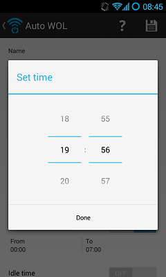

This post will show you how to return a value set in a dialog fragment back to the parent activity it was called from. Code sample provided here is from the [Auto-WOL app](https://play.google.com/store/apps/details?id=net.cmikavac.autowol) I made not so long ago, so if you need the bigger picture, feel free to check [TimePickerFragment](https://github.com/pootzko/auto-wol/blob/master/src/net/cmikavac/autowol/partials/TimePickerFragment.java) and [DeviceActivity](https://github.com/pootzko/auto-wol/blob/master/src/net/cmikavac/autowol/DeviceActivity.java) classes over at GitHub. This example uses `TimePickerDialog`. It also keeps track of the layoutId (where the layout it is bound to acts as a button in the UI) because in my app I have multiple buttons which can invoke the same TimePickerFragment so I needed to know which button invoked the dialog fragment because upon selecting the time the button caption gets updated.



So, to make this whole thing work, we will need a fragment class which will extend `DialogFragment` and implement `TimePickerDialog.OnTimeSetListener`. This class will expose the `OnTimePickedListener` interface so it could later be consumed by the parent activity. This class will also be responsible for registering and calling the callback on time set event. The defined `OnTimePickedListener` interface has only one method signature - `onTimePicked()`, which will need to be implemented by the parent activity. Other than this, the class only has a few more overrides and that's all.

```java
// TimePickerFragment.java

/**
 * This class is used so values from TimePickerFragment could be
 * returned back to the activity from which it was called.
 */
public class TimePickerFragment extends DialogFragment implements TimePickerDialog.OnTimeSetListener {
    OnTimePickedListener mCallback;
    Integer mLayoutId = null;

    /**
     * An interface containing onTimePicked() method signature.
     * Container Activity must implement this interface.
     */
    public interface OnTimePickedListener {
        public void onTimePicked(int textId, int hour, int minute);
    }

    /* (non-Javadoc)
     * @see android.app.DialogFragment#onAttach(android.app.Activity)
     */
    @Override
    public void onAttach(Activity activity) {
        super.onAttach(activity);

        try {
            mCallback = (OnTimePickedListener)activity;
        } catch (ClassCastException e) {
            throw new ClassCastException(activity.toString() + " must implement OnTimePickedListener.");
        }
    }

    /* (non-Javadoc)
     * @see android.app.DialogFragment#onCreateDialog(android.os.Bundle)
     */
    @Override
    public Dialog onCreateDialog(Bundle savedInstanceState) {
        mCallback = (OnTimePickedListener)getActivity();

        Bundle bundle = this.getArguments();
        mLayoutId = bundle.getInt("layoutId");
        int hour = bundle.getInt("hour");
        int minute = bundle.getInt("minute");

        // Create a new instance of TimePickerDialog and return it
        return new TimePickerDialog(getActivity(), this, hour, minute, DateFormat.is24HourFormat(getActivity()));
    }

    /* (non-Javadoc)
     * @see android.app.TimePickerDialog.OnTimeSetListener#onTimeSet(android.widget.TimePicker, int, int)
     */
    public void onTimeSet(TimePicker view, int hour, int minute) {
        if(mCallback != null)
        {
            mCallback.onTimePicked(mLayoutId, hour, minute);
        }
    }
}
```

The parent activity class implements the `OnTimePickedListener` defined in `TimePickerFragment`. This means we are required to override the `onTimePicked()` method. This method is what gets executed after time has been picked in the dialog pop-up and "Done" confirmation button has been pressed. From here you're back in your activity class and can do whatever you want with the obtained data.

```java
// DeviceActivity.java

public class DeviceActivity extends BaseActivity implements OnTimePickedListener {
    ...

    /**
     * On time picked event, converts hour and minutes values to milliseconds
     * milliseconds and sets a new value for the layout in the activity.
     * @param layoutId      QuietHoursFrom or QuietHoursTo layout Id.
     * @param hour          Hour value.
     * @param minute        Minutes value.
     */
    @Override
    public void onTimePicked(int layoutId, int hour, int minute) {
        Long timeInMillis = TimeUtil.getTimeInMilliseconds(hour, minute);

        // Here you can do whatever needed with value obtained from the fragment
    }

    ...
}
```