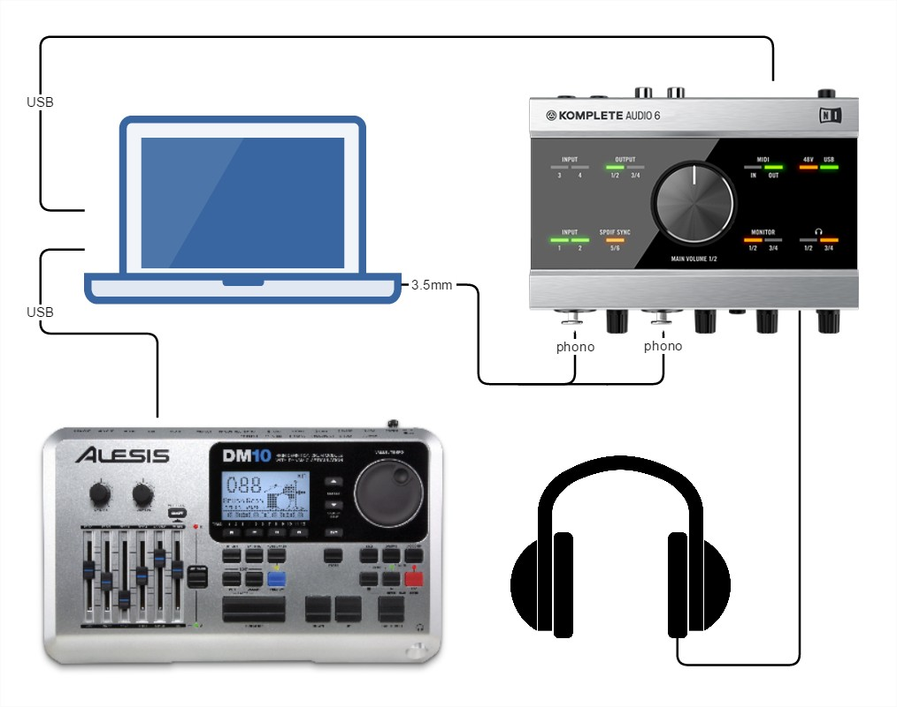
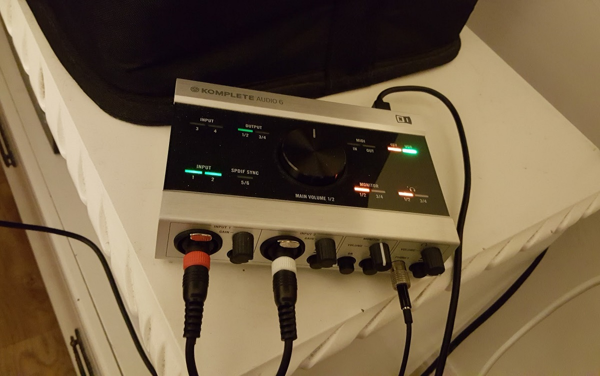
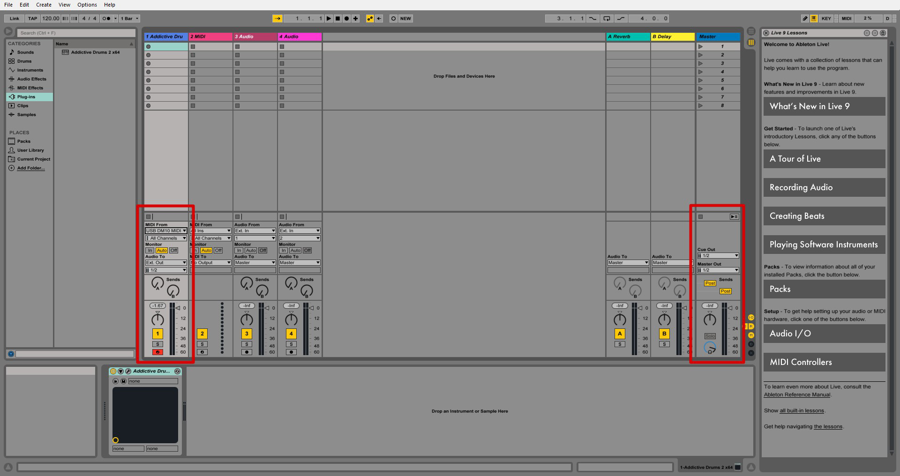
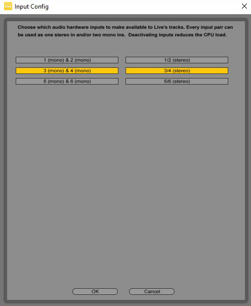
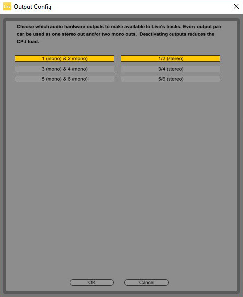
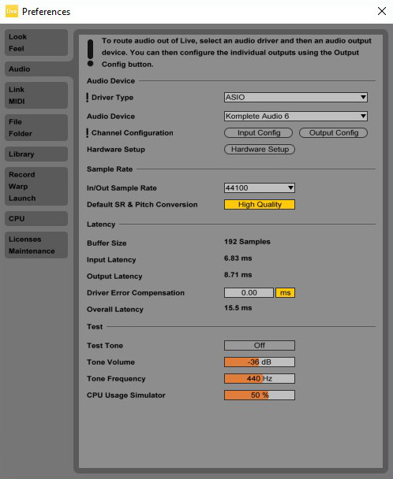
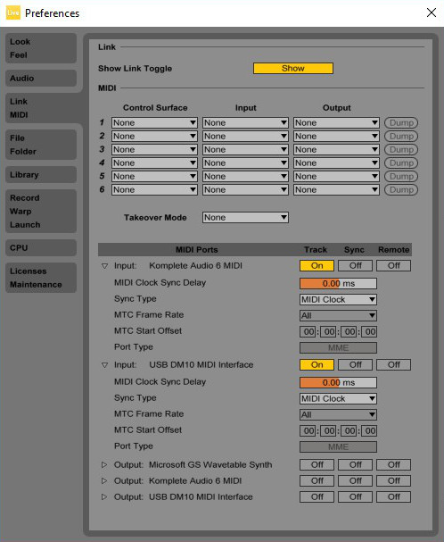
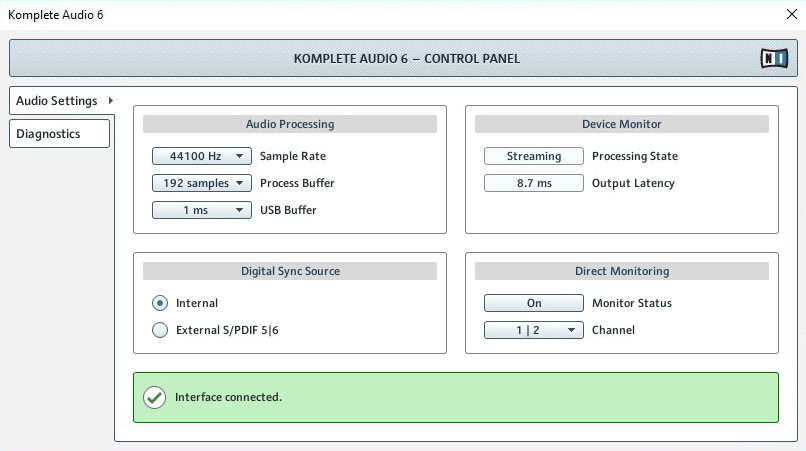
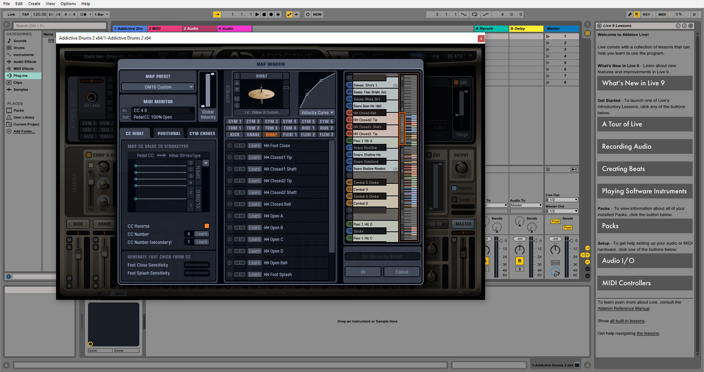

Hopefully this post will help you if you're looking to setup your eDrums with Ableton and Addictive Drums 2 (or any another virtual drum kit with a [VST](https://en.wikipedia.org/wiki/Virtual_Studio_Technology) for Ableton). I don't know that much about music equipment so it took me a while to figure out where all the pieces fall into place.

My [initial issue](http://music.stackexchange.com/questions/45193/electronic-drums-ableton-addictive-drums-additional-audio-source-from-laptop) with Ableton and AD2 was that MS Windows OS has very bad audio support (drivers) for anything more advanced than the simplest form of audio reproduction through speakers or headphones. What I wanted was to connect the [Alesis DM10](http://www.alesis.com/products/view2/dm10-studio-mesh) to my laptop to get better quality drum samples with AD2 than what I had with the DM10 module and to be able to turn on a YouTube video and to play alongside with it. It didn't take long for me to realize this wouldn't work. Even with [ASIO4ALL](http://www.asio4all.com/) drivers, I could either get Ableton or the browser to output the sound into the headphones, not both at the same time.

So, after a bit of research and some advice from a few fellow musicians, I decided that what I needed was a USB audio interface that would also act as a mixer. After doing a bit more research, I found out that [Komplete Audio 6](https://www.native-instruments.com/en/products/komplete/audio-interfaces/komplete-audio-6/) was quite popular amongst drummers who wanted a low latency audio interface for triggering VST's. I'm sure any other USB enabled interface with balanced input could easily do the job as well.

Amazon.

The next few steps included removing the ASIO4ALL drivers, installing official Komplete Audio 6 drivers, [setting up Ableton with AD2 VST](http://www.noterepeat.com/products/alesis/electronic-percussion/dm10/247-alesis-dm10-setup-with-addictive-drums) (make sure to check the "install as VST" checkbox during AD2 installation) and wiring up the hardware together.

This is how the Komplete 6 is supposed to light up when everything is connected and setup properly (both inputs are set to INST, headphones are set to 1/2, 48V on the back side is ON and the monitor "ON button" needs to be pressed once every time you turn this whole setup on):

This is how the channels IN/OUT setup in Ableton looks like (click to view the full resolution screenshot):

Input:

Output:

Ableton audio preferences:

Ableton link/MIDI preferences:

Komplete Audio 6 control panel:

And this is the screen where you can map the DM10 MIDI triggers to AD2 sounds (this <a href="Addictive-Drums-2-Keymap.pdf" target="_blank">AD2 keymap</a> might help you with that):

To map the triggers easier, press the "Learn" button and then hit the element that you wish to map with a stick. This will utilize AD's "smart learning" and will automatically map the input from a trigger with an AD2 element (snare, hi-hat, kick, whatever..). Sometimes it's a bit hard to use this (for example the ride bell which can be somewhat hard to trigger on DM10) but I found that for all the other elements it does the job really well.

You might also want to slightly [adjust triggers sensitivity](http://www.noterepeat.com/products/alesis/electronic-percussion/dm10/153-alesis-dm10-quick-start-settings-guide) on the DM10 module itself to make the AD2 respond more to your liking and expectations (you can make it require more or less force to produce trigger sound). Use that in conjunction with the curve on the righthand side of the hi-hat image from the last screenshot.

All in all, I'm really happy with how this works. The latency is very minimal and 99% of the time it's not in the way of playing. I do have an SSD in the laptop and there was a noticeable difference in how Ableton/AD2 performed while the crappy 5400 was inside and after I installed the SSD. The CPU in the laptop is the [i7-4510U](http://ark.intel.com/products/81015/Intel-Core-i7-4510U-Processor-4M-Cache-up-to-3_10-GHz) (not sure if that makes any difference or not).

Hope this helps. If you have any questions or a different setup that you'd like to share, leave a comment. Cheers!