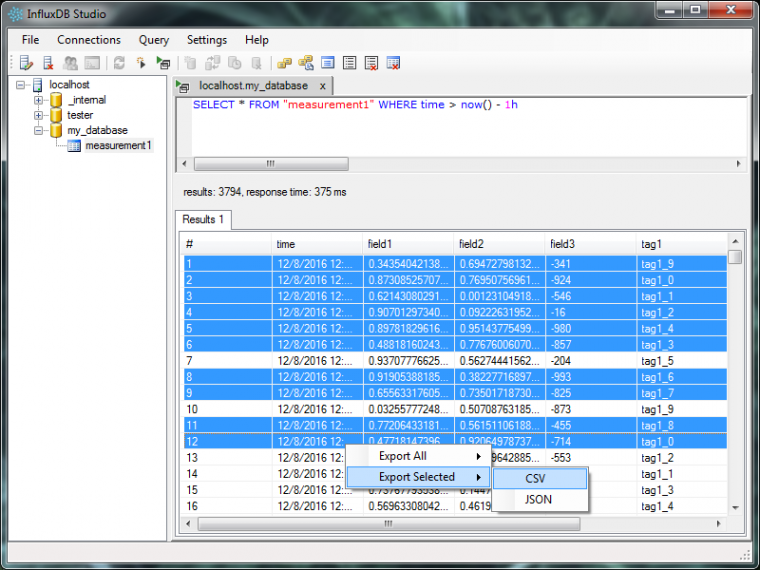

It feels great when someone uses something you made and thinks it's good. Every now and then someone creates a pull request for the [InfuxData.Net lib](https://www.nuget.org/packages/InfluxData.Net/) I made and have been maintaining. It's sort of a nice confirmation of your efforts and makes you warm and fuzzy on the inside. :D

Well, this guy named [meverett](https://github.com/meverett) recently made a few [pull requests](https://github.com/pootzko/InfluxData.Net/graphs/contributors) with fixes and some nice lib improvements AND then told me that he's actually using the library to make an [InfluxDB database management studio](https://github.com/CymaticLabs/InfluxDBStudio) (sort of what SQL Management Studio is for SQL, but for InfluxDB)!

I find the admin dashboard that comes with InfluxDB a bit too simplistic and buggy and was actually thinking about how useful it would be if only there was a proper management app for Influx. Well, the InfluxDB Studio does more than the web admin dashboard and works great. And it made me really happy! :D

Here is how it looks:

Thanks for the great work meverett!