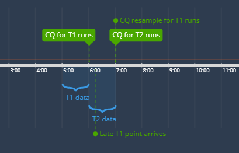

If you’re manually time-stamping your data and perhaps also batch-saving it to InfluxDB, there’s a high probability that some of your data points are arriving slightly late and are not being taken into account when the continuous query kicks in and creates a downsampled record.

Lets take a 1-hour interval as an example. If your data point point gets written into InfluxDB even a second after the full hour, it won’t be used by the continuous query to calculate the downsample for the previous hour. A CQ which was set to run every hour will run precisely at the beginning of each hour.

Now, the best way to deal with this would be to have a way of simply delaying the CQ execution by a certain amount of time so that it runs only when we’re certain that all the data points have already arrived. Unfortunately this is currently [not possible](https://github.com/influxdata/influxdb/issues/6932) with InfluxDB but – there is another approach which although not perfect, will help us out if we’re looking for downsampled data with as much precision and correctness as possible.

What we can do is, we can specify a [RESAMPLE interval](https://docs.influxdata.com/influxdb/v1.5/query_language/continuous_queries/#advanced-syntax) when we define a CQ. If we take the 1-hour example, what this means is we can specify for how long will the CQ keep re-downsampling the data for the same hour. This simple timeline will help in better understanding the basic idea:



Say we collected some data between 5am and 6am. CQ runs at exactly 6h mark and creates a new “downsample record” for the previous hour (T1). However, a point with a timestamp of 5h59m47s might arrive to InfluxDB at 6h00m18s. The problem is that the late point won’t end up in either the 5-6h downsample (because the CQ had already ran at this point) nor the 6-7h downsample (because the timestamp does not belong to this time interval).

However, if we specified the RESAMPLE interval of say 2h in our CQ, the CQ would run on the 5-6h interval dataset for the second time at the 7h mark, but this time it would take into account the late data point as well. If we specified a RESAMPLE interval of 3h, the CQ would run for the same 5-6h interval 3 times and so on.

Here’s a sample piece of code which does what was just described:

```sql
CREATE CONTINUOUS QUERY "sensor_downsample_1h" ON "my-influx-db"
RESAMPLE FOR 2h
BEGIN
  SELECT
    mean(Temperature) as "Temperature",
    mean(Humidity) as "Humidity",
    min(Temperature) as "TemperatureMin",
    min(Humidity) as "HumidityMin",
    max(Temperature) as "TemperatureMax",
    max(Humidity) as "HumidityMax",
    count(Temperature) as "SampleCount"
  INTO "my-influx-db"."autogen"."sensor.downsample.1h"
  FROM "my-influx-db"."autogen"."sensor"
  GROUP BY time(1h), * fill(none)
END
```

Earlier I mentioned that this approach is not perfect. Why? It’s because we’re doing the downsampling twice. Depending on the amount of data that you have, this might potentially be an unnecessary performance hit. But, if you have many late points, it might also be critical to not just ignore them. So it’s a potential trade-off between precision and performance and you’ll have to evaluate your use case and decide if this approach will work for you or not.

Hope it helped. If you have any questions, drop them in the comments. Cheers.