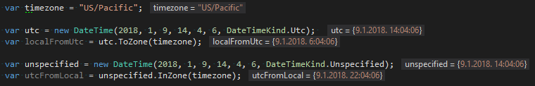
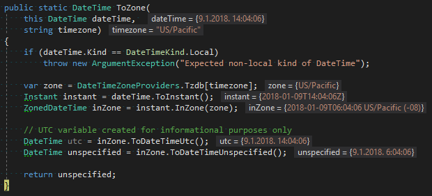
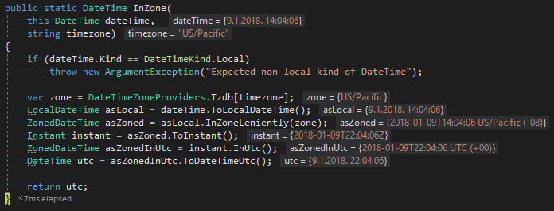

Working with DateTime in .Net [can be quirky](https://blog.nodatime.org/2011/08/what-wrong-with-datetime-anyway.html). Even more, default .Net libraries follow MS standards and use [their own set of timezones](https://stackoverflow.com/a/7908482/413785) instead of the widely accepted [TZDB (IANA)](https://en.wikipedia.org/wiki/Tz_database) standard (which you should probably be using instead – because standards are good for you). Without going into too much detail, you will probably do yourself a favour if you go straight to [Noda Time](https://nodatime.org/) library for all your timezone conversion needs. Noda Time is a very powerful library for handling all things date and time and it’s made by none other than Jon Skeet himself. To make things easy and precise for all of us, he keeps track of all the changes that happen to the [TZDB list](https://en.wikipedia.org/wiki/List_of_tz_database_time_zones) (yes, countries still keep changing these things around) and makes sure the library is up to date.

The two examples in the demo explain the most basic things you might want to do with time and timezones:

 1. Converting UTC time to local time in a certain timezone
 2. Trying to find out what the UTC representation of time is for local time in a certain timezone


I used the *US/Pacific* timezone (which is UTC-8h) in sample code. All screenshots display current variable values so it’s easy to follow what’s going on with various date objects as they get converted back and forth.

The first example creates a UTC DateTimeKind DateTime object and converts it to local *US/Pacific* time and the second example converts the local *US/Pacific* object of *Unspecified* DateTimeKind to UTC. Notice how time in both examples gets shifted by 8h but in opposite directions.



And since that was a screenshot, here is the code sample in case you want to c/p it:

```cs
var timezone = "US/Pacific";

var utc = new DateTime(2018, 1, 9, 14, 4, 6, DateTimeKind.Utc);
var localFromUtc = utc.ToZone(timezone);

var unspecified = new DateTime(2018, 1, 9, 14, 4, 6, DateTimeKind.Unspecified);
var utcFromLocal = unspecified.InZone(timezone);
```

The following screenshots visualize all the mini-steps of each of the two conversions. The first one is really simple and there’s not much that needs to be done to convert from UTC to local time. The second one one the other hand has to be converted multiple time to get the UTC from local time. Values of all the variables have been displayed so hopefully it will be easy to follow. I’ll let the code speak for itself:





And the code for both methods:

```cs
public static class DateTimeExtensions
{
    /// <summary>
    /// Converts a non-local-time DateTime to a local-time DateTime based on the
    /// specified timezone. The returned object will be of Unspecified DateTimeKind
    /// which represents local time agnostic to servers timezone. To be used when
    /// we want to convert UTC to local time somewhere in the world.
    /// </summary>
    /// <param name="dateTime">Non-local DateTime as UTC or Unspecified DateTimeKind.</param>
    /// <param name="timezone">Timezone name (in TZDB format).</param>
    /// <returns>Local DateTime as Unspecified DateTimeKind.</returns>
    public static DateTime ToZone(this DateTime dateTime, string timezone)
    {
        if (dateTime.Kind == DateTimeKind.Local)
            throw new ArgumentException("Expected non-local kind of DateTime");

        var zone = DateTimeZoneProviders.Tzdb[timezone];
        Instant instant = dateTime.ToInstant();
        ZonedDateTime inZone = instant.InZone(zone);
        DateTime unspecified = inZone.ToDateTimeUnspecified();

        return unspecified;
    }

    /// <summary>
    /// Converts a local-time DateTime to UTC DateTime based on the specified
    /// timezone. The returned object will be of UTC DateTimeKind. To be used
    /// when we want to know what's the UTC representation of the time somewhere
    /// in the world.
    /// </summary>
    /// <param name="dateTime">Local DateTime as UTC or Unspecified DateTimeKind.</param>
    /// <param name="timezone">Timezone name (in TZDB format).</param>
    /// <returns>UTC DateTime as UTC DateTimeKind.</returns>
    public static DateTime InZone(this DateTime dateTime, string timezone)
    {
        if (dateTime.Kind == DateTimeKind.Local)
            throw new ArgumentException("Expected non-local kind of DateTime");

        var zone = DateTimeZoneProviders.Tzdb[timezone];
        LocalDateTime asLocal = dateTime.ToLocalDateTime();
        ZonedDateTime asZoned = asLocal.InZoneLeniently(zone);
        Instant instant = asZoned.ToInstant();
        ZonedDateTime asZonedInUtc = instant.InUtc();
        DateTime utc = asZonedInUtc.ToDateTimeUtc();

        return utc;
    }
}
```

Also, here’s one additional [article](https://nodatime.org/2.2.x/userguide/type-choices) you should probably read if you intend to work with Noda Time in your code. It will help you wrap your head around Noda Time data types, choosing the right one for the job and conversions between them.