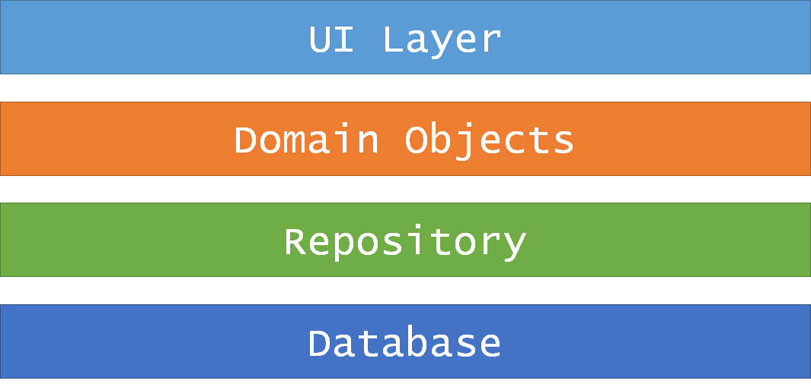
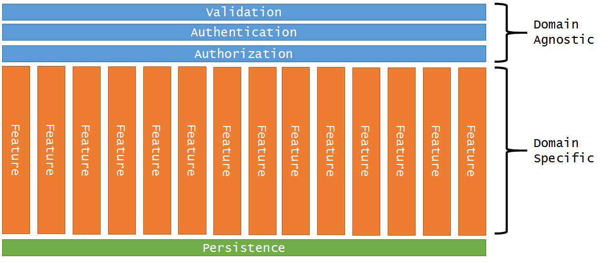
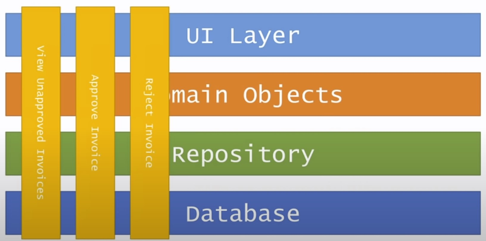
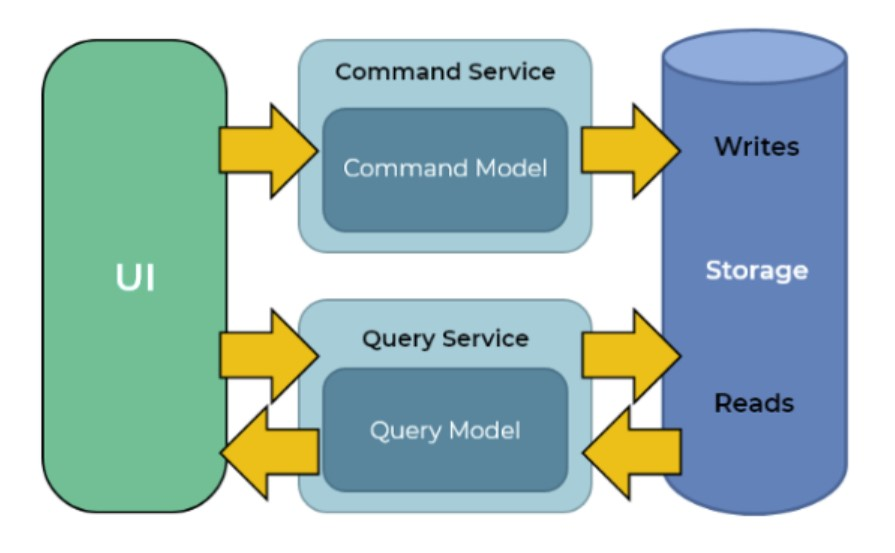

For the past year I've been playing with [Jimmy Bogard's vertical slice architecture](https://jimmybogard.com/vertical-slice-architecture/) on a personal project and I became a fan. I recently recommended we start using it at work and after the initial positive feedback I was asked to prepare a bit of a pitch for my co-workers. So I decided to document my thoughts here. This will be mostly just a bunch of notes, references and personal observations to help me preach. If you find it useful, great! If you have anything to add or object to, please leave a comment. Thanks!

Naturally, I think the best pitch really is to just watch Jimmy explain it. I'll leave these 2 videos here for your pleasure:

<iframe width="560" height="315" src="https://www.youtube.com/embed/L3SvIKdLt88" title="YouTube video player" frameborder="0" allow="accelerometer; autoplay; clipboard-write; encrypted-media; gyroscope; picture-in-picture" allowfullscreen></iframe>

<iframe width="560" height="315" src="https://www.youtube.com/embed/5kOzZz2vj2o" title="YouTube video player" frameborder="0" allow="accelerometer; autoplay; clipboard-write; encrypted-media; gyroscope; picture-in-picture" allowfullscreen></iframe>

  

## What we currently have (N-Tier)

In very generic terms, this is how N-Tier is typically represented (image taken from Jimmy):

And here is an overview of how we currently structure our projects:

#### WebAPI layer

- Application bootstrapping / configuration
- Simple Authentication / Authorization through the `[Authorize]` .Net attribute
  - Ok for simple authentication / user role checks
- Simple model validation through a custom `[ValidateModelState]` controller action attribute
  - [Intercepts](https://tkit.dev/2015/09/27/handling-nets-model-state-with-validationfilter-attribute/) incoming models on `OnActionExecuting()`
  - Ok for simple .Net [validation attribute](https://docs.microsoft.com/en-us/aspnet/core/mvc/models/validation?view=aspnetcore-5.0#validation-attributes) based property validation
  - Exception based
- Routing
- Global exception handler

#### Business layer

- Services
  - Business (domain) logic
  - Invocation of Entity-to-View-Model mappings
  - More complex authorization which typically requires a trip to the DB to:
    - Ensure user is authorized to access / modify a resource
    - Ensure user belongs to a company
    - Ensure IP whitelisted
  - More complex model validation
    - [FluentValidation](https://fluentvalidation.net/) - More complicated validation rules that can't be accomplished using basic .Net validation attributes
    - Trips to the DB to validate the model
      - Ensure a DB record with the same name does not already exist
      - Ensure user didn't already fulfill his allowed user space / quota
- Providers
  - Email sender
  - SMS sender
  - 3rd party API's adapters
- Data Mappers
  - Static Entity-to-View-Model mapper classes
  - Shared, domain data-mapping logic

#### Auth layer

- Common security providers
  - Complex security checks that require trips to the DB
  - Typically consumed by business layer services
- Custom auth / security infrastructure code

#### Repository layer

- Base and generic repository classes
  - Basically generic LLBLGen ORM wrapper code
- Specific repositories built on top of our `IRepository<T>` such as:
  - IUserRepository
  - ICustomerRepository
  - IOrderRepository
- Specific lookup repositories built in top our `ILookupRepository<T>` such as:
  - IProductTypeLookup
  - IUserRoleLookup

#### Core layer

- Cross-cutting (accessible by WebAPI / Business / Repository layers)
- GET models, POST/PUT models, grid filtering models
- Custom exception types
- Common extension / helper classes for primitive / basic types

## Identified issues

### Too many scattered files have to be created / touched to add a new feature

- Files not close together in the project structure, but instead scattered
- A lot of ceremony, not necessarily that much value
  - Is the structure improving things or is it being in the way of doing work?
- Wastes time
- Adds to cognitive load
- Annoying
- Files that typically require touching / creation to add a new feature:
  - Controller
  - Service interface
  - Service implementation class
  - If the service is a brand new one - DI binding needs to be added to the DI composition
  - Repository interface
  - Repository implementation class
  - If the repository is a brand new one - DI binding needs to be added to the DI composition
  - Model class
  - Entity-to-Model mapping class

### Fuzzy separation of concerns as the project grows

- Initially very specific pieces of code start doing too much and being too abstract for the sake of being reused
- This is bad code reuse which leads to:
  - Bloated [god object](https://en.wikipedia.org/wiki/God_object) models
  - Bloated repository methods
    - [Multi-level fetching](https://entityframework.net/include-multiple-levels) bloat ([prefetching](https://www.llblgen.com/Documentation/5.3/LLBLGen%20Pro%20RTF/Using%20the%20generated%20code/Adapter/gencode_prefetchpaths_adapter.htm) in LLBLGen) - too much data being fetched from the DB even when it's not all needed
    - Filtering becomes too complex / too smart
    - Many filtering options have to become "optional"
  - Changes in one feature can have undesired effects and break other features which reuse the same shared abstraction

### Authorization / Model validation scattered between 2 layers

- Harder to reason about - at least 2 places (a controller and a service) need to be checked to get the full picture and to be sure what the rules are
- These rules are arguably part of the business logic and have no place being in controllers
- If multiple applications rely on the same business layer, this could greatly degrade maintainability
  - Part of the functionality could get overlooked because it's in controllers
  - Other applications will have to somehow still apply the rules
  - Rules could easily get out of sync because logic is not in one place
- Harder unit testing
  - Controllers are not typically being unit tested
  - Attribute behavior is weird to unit test
  - Since rules are not applied in the same place, how do you even test it as a "unit"?

### Exception based code flow

- Basically GOTO statements on steroids
- Hard to predict and follow and sometimes a little more inconvenient to test
- An implicit way of dealing with code flow through side-effects
- [Exceptions](https://medium.com/codex/the-error-of-exceptions-3aed074c40dc) obfuscate possible outcomes of invoking a method - how do we know what will be thrown?
- Exceptions should stay exceptions, not become rules

## Vertical Slice

We use SPA's on client-side. There, we already started grouping code by features a long time ago because it's just much more convenient. Module routing, service code, controllers, templates, components most often all get grouped together inside a dedicated folder. VueJS and React even go as far to encourage putting controllers, templates and styles into a single file.

Vertical slice architecture that Jimmy Bogard describes is in a way similar to that - why would we _not_ bundle things together on the backend?

### New, shiny stuff

- [CQRS](https://www.martinfowler.com/bliki/CQRS.html) - Command Query Responsibility Segregation
- [MediatR](https://github.com/jbogard/MediatR) - Decoupling of in-process sending of messages from handling messages
  - Gives uniform structure to the whole team
  - Easy behavior pipelines (cross-cutting concerns)
- [Result type](https://docs.microsoft.com/en-us/dotnet/fsharp/language-reference/results) - Replaces exception-based code flow

## CQRS

- Queries read but don't mutate data
  - Safe, idempotent
- Commands create / mutate but don't return data
  - Unsafe, not idempotent
  - I actually broke this rule slightly to allow returning of the Id of newly created entities, but nothing more
- Typically now two models where once there was one (which would be reused)
- SEE: [CQS vs. CQRS](https://stackoverflow.com/questions/34255490/difference-between-cqrs-vs-cqs)
- Behavior pipelines handle cross-cutting concerns
  - Authentication
  - Authorization
  - Validation
  - Transactions
  - Caching
  - Retries
  - Logging

## Solutions to previous N-Tier issues

### Reduced number of files required per feature

A feature implemented using vertical slicing typically requires only 2 files to be touched / created:

- A controller action entry for routing purposes / message dispatching
- A command / query handler file which contains:
  - Query / Command model class
  - Custom validator method (optional)
  - Custom authorization method (optional)
  - Query / Command handler class
    - ORM code
    - Business logic
    - Entity-to-Model mapping
  - Query return model (for queries only)
  - Having a single file for all this is OK

Instead of using specific repositories:

- Handlers inject generic repositories
- Each handler writes its own ORM logic
- For common ORM code, better to write very specific prefetch / bucket builder extension methods ([pure functions](https://en.wikipedia.org/wiki/Pure_function))
  - Avoid for trivial cases
  - Avoid for low reused cases
    - Maybe not really that common after all?
  - Introduces coupling, so be careful
  - "User profile" prefetch is an example of a good candidate
    - AspNetUser + UserDetail + AspNetUserRoles + AspNetRoles

Note how we no longer need all the service / repository interface files.

For complex, heavy domain logic that will see heavy reuse, it's ok to use a separate `*.Domain` project and to use use pure, [rich domain models](https://en.wikipedia.org/wiki/Domain-driven_design). These can then be shared by handlers. In many cases, this is not really necessary however as the logic is often simple enough to stay self-contained inside a handler - only introduce abstractions when there are pain-points.

### Clear separation of concerns

Each feature is in a way isolated and self-contained.

- Each feature has its own view model
- No more bloated god object models
- No more bloated repository methods
- Changing one feature no longer affects / breaks other features

### Authorization / Model validation in one place

- Easier to reason about
- No need to worry that part of the implementation will be overlooked in other applications
- Can be easily tested

### `Result<T>` based code flow

- Explicit code flow
- More predictable
- Less side-effects
- SEE: [Railway oriented programming](https://fsharpforfunandprofit.com/posts/recipe-part2/)

## Typical handler

TBA

## Downsides

- More models
- More files
- New paradigm, teams needs to be trained a bit
- Might potentially be a bit harder for Junior developers
  - Not the default .Net documentation architecture
  - Not the default Visual Studio .Net scaffold
  - Less code samples online

## Other

- Suitable for [event sourcing](https://docs.microsoft.com/en-us/azure/architecture/patterns/event-sourcing)
- Suitable for microservices
- Multiple ORMS can be used easily at the same time if needed
- If there's a need to swap out an ORM (most often there is not), it can easily be done gradually
- Routing can be simplified even further by removing most of the controllers and using
  - [Carter](https://github.com/CarterCommunity/Carter)
  - [ApiEndpoints](https://github.com/ardalis/ApiEndpoints)
- Feature code sharing - avoid, infrastructure code - reuse

## Additional resources

- [Microservices.Net](https://devmentors.io/courses/microservices-net) ~ DevMentors
- [Get value out of your monad](https://www.youtube.com/watch?v=F9bznonKc64) ~ Mark Seemann
- [Functional design patterns](https://www.youtube.com/watch?v=srQt1NAHYC0) ~ Scott Wlaschin
- [Domain Modeling Made Functional](https://www.youtube.com/watch?v=1pSH8kElmM4) ~ Scott Wlaschin
- [The Functional Programmer's Toolkit](https://www.youtube.com/watch?v=Nrp_LZ-XGsY) ~ Scott Wlaschin
